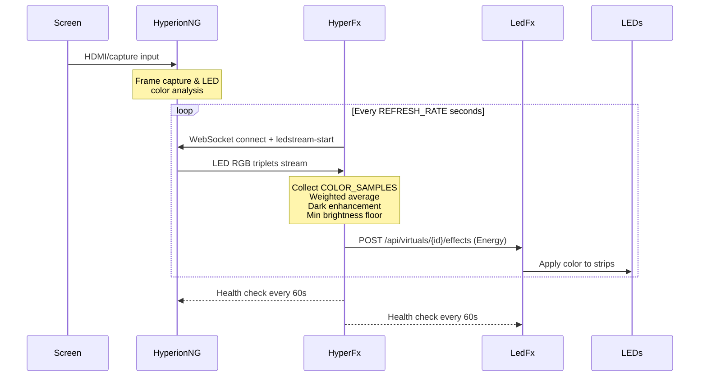
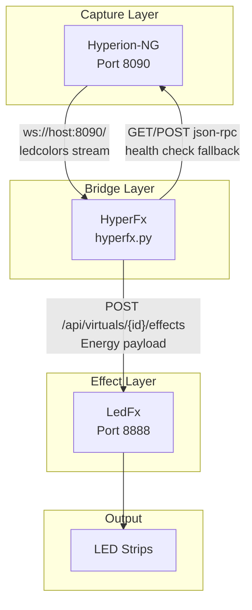
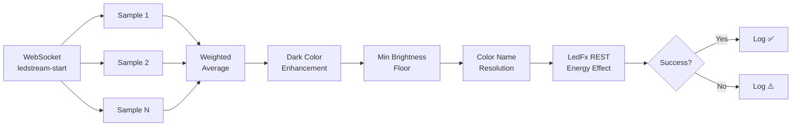
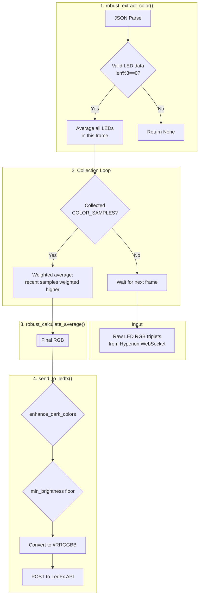
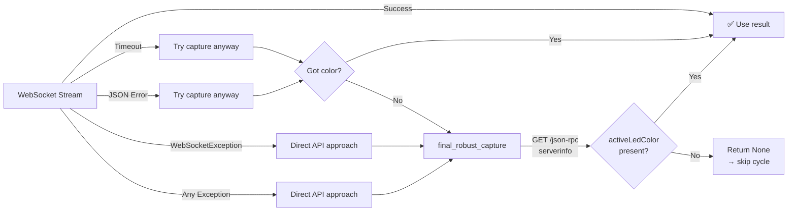

# HyperFx — Hyperion-NG → LedFx Live Color Sync

**HyperFx** is a real-time bridge that captures LED color data from **Hyperion-NG** (ambilight) and forwards it to **LedFx** virtual devices for synchronized ambient lighting. It continuously reads Hyperion-NG's LED color stream over WebSocket, applies configurable color processing (sampling, averaging, brightness enhancement), and pushes the result as an Energy effect to LedFx via REST API.

```text
Screen Content  →  Hyperion-NG  →  WebSocket  →  HyperFx  →  REST API  →  LedFx  →  LED Strips
```

---

## Table of Contents

- [How It Works](#how-it-works)
- [Architecture](#architecture)
- [Quick Start](#quick-start)
- [Configuration Reference](#configuration-reference)
- [Color Processing Pipeline](#color-processing-pipeline)
- [Fallback Strategy](#fallback-strategy)
- [API Contracts](#api-contracts)
- [Performance](#performance)
- [Troubleshooting](#troubleshooting)
- [LLM Agent Context](#llm-agent-context)
- [Development](#development)
- [License](#license)

---

## How It Works

HyperFx runs a `continuous_sync_loop()` that repeats this cycle:



1. **WebSocket connection** to Hyperion-NG's `ledcolors` stream
2. **Collect** `COLOR_SAMPLES` individual LED data frames
3. **Calculate** a weighted running average (recent samples weighted higher)
4. **Enhance** dark colors (configurable boost for indoor festival use)
5. **Apply** minimum brightness floor (daylight visibility guard)
6. **Send** the final RGB triplet as an Energy effect to LedFx
7. **Wait** `REFRESH_RATE` seconds, then repeat

Updates are skipped if the color has not changed since the last cycle (reduces unnecessary API calls).

---

## Architecture

### Component Topology



### Data Flow Detail



### File Layout

```text
hyperion-ng-ledfx-live-color-sync/
├── hyperfx.py              # Main application (single file, ~787 lines)
├── requirements.txt        # Python dependencies
├── dotenv-example          # Documented .env template with all options
├── .env                    # Your local configuration (gitignored)
├── LICENSE                 # MIT License
├── hyperfx.code-workspace  # VS Code workspace file
└── docs/
    └── public/ 
        ├── docs.json
        ├── index.mdx
        ├── getting-started/
        ├── guides/
        ├── configuration/
        ├── api/
        ├── operations/
        └── development/
```

---

## Quick Start

### Prerequisites

- Python 3.7+
- [Hyperion-NG](https://hyperion-project.org/) running and capturing screen content
- [LedFx](https://github.com/LedFx/LedFx) running with a virtual device configured

### Install

```bash
# Clone the repo
git clone <repo-url>
cd hyperion-ng-ledfx-live-color-sync

# Create a virtual environment (recommended)
python -m venv .venv
source .venv/bin/activate

# Install dependencies
pip install -r requirements.txt

# Configure your environment
cp dotenv-example .env
# Edit .env with your host/IPs and preferences
```

### Configure Minimum `.env`

```ini
HYPERION_HOST=192.168.1.100
HYPERION_PORT=8090
LEDFX_HOST=192.168.1.100
LEDFX_PORT=8888
LEDFX_INSTANCE=hyperfx
```

> **Finding `LEDFX_INSTANCE`:** In LedFx web UI, create a virtual named `hyperfx` (Virtuals → Add Virtual). The URL slug becomes the instance name. Alternatively, list virtuals via `curl http://<ledfx-host>:8888/api/virtuals`.

### Run

```bash
python hyperfx.py
```

Press **Ctrl+C** to stop. Logs are printed to stdout via [Loguru](https://github.com/Delgan/loguru).

---

## Configuration Reference

All configuration is via environment variables (`.env` file).

### Connection

| Variable | Default | Description |
|---|---|---|
| `HYPERION_HOST` | *(required)* | Hyperion-NG server IP/hostname |
| `HYPERION_PORT` | `8090` | Hyperion-NG JSON API / WebSocket port |
| `LEDFX_HOST` | *(required)* | LedFx server IP/hostname |
| `LEDFX_PORT` | `8888` | LedFx REST API port |
| `LEDFX_INSTANCE` | `hyperfx` | LedFx virtual device URL slug |

### Sync Timing

| Variable | Default | Description |
|---|---|---|
| `REFRESH_RATE` | `0.1` | Seconds between sync cycles. Clamped to 0.01–2.0. |
| `COLOR_SAMPLES` | `3` | LED data frames collected per sync cycle. Higher = smoother but slower to respond. |

**Refresh rate examples:**

| REFRESH_RATE | Effective FPS | Use case |
|---|---|---|
| 0.0167 | ≈60 | Responsive gaming |
| 0.0333 | ≈30 | General video |
| 0.05 | ≈20 | Balanced |
| 0.1 | ≈10 | Gentle on CPU (default) |

### Brightness & Enhancement

| Variable | Default | Range | Description |
|---|---|---|---|
| `BRIGHTNESS` | `1.0` | 0.0–1.0 | Master brightness sent in the Energy effect payload |
| `MIN_BRIGHTNESS` | `0` | 0–255 | **Minimum brightness floor.** When the captured color is dimmer than this floor (measured by max channel), all channels are scaled up proportionally preserving hue. Pure black (0,0,0) becomes a warm-white floor. 0 = off. |
| `BRIGHTNESS_ENHANCE_ENABLE` | `true` | `true`/`false` | Enable dark-color brightness boost for dance festival / dim content |
| `BRIGHTNESS_ENHANCE_THRESHOLD` | `80` | 0–255 | Max channel value below which enhancement kicks in |
| `BRIGHTNESS_ENHANCE_FACTOR` | `1.5` | 1.0–3.0 | Brightening multiplier. Darker pixels are boosted proportionally more (darkness ratio × factor). |

**MIN_BRIGHTNESS quick reference:**

| Value | Environment |
|---|---|
| 0 | Dark room / home theater — original colors preserved |
| 30–80 | Dim indoor lighting — gentle floor |
| 80–120 | **Living room / daylight / parties** (recommended start) |
| 120–180 | Bright room / near windows |
| 180–255 | Not recommended — washes out color variation |

### Logging

| Variable | Default | Description |
|---|---|---|
| `DEBUG` | `false` | `true` = detailed per-file/line debug logging; `false` = concise INFO-level |

### LedFx Effect Configuration (hardcoded in `send_to_ledfx()`)

```json
{
  "type": "energy",
  "config": {
    "color_high": "#RRGGBB",
    "color_mids": "#RRGGBB",
    "color_lows": "#RRGGBB",
    "brightness": 1.0,
    "background_brightness": 0.1,
    "intensity": 1.0
  }
}
```

All three color channels receive the same hex value (monochromatic Energy effect).

---

## Color Processing Pipeline

The signal chain in `RobustLedFxSync` is:



### Key algorithms

**Weighted average** (`robust_calculate_average`):
Samples are weighted `[1, 2, 3, ..., N]` so more recent samples contribute more. A flat-average fallback exists if the weighted calculation fails.

**Dark enhancement** (`enhance_dark_colors`):
If the max RGB channel ≤ `BRIGHTNESS_ENHANCE_THRESHOLD`, the color is boosted by a factor that scales with darkness ratio:
$$factor = 1.0 + \frac{(threshold - maxChannel)}{threshold} \times (enhanceFactor - 1.0)$$

**Min brightness floor** (`send_to_ledfx`):
If `MIN_BRIGHTNESS > 0` and the brightest channel is below it:
- **Pure black** → warm white floor `(floor, floor, floor/2)`
- **Dim color** → scale all channels so brightest = MIN_BRIGHTNESS

**Safety floor**: Pure black is always caught and set to `(3, 3, 6)` (barely visible warm dim) even when `MIN_BRIGHTNESS=0`.

**Color name resolution** (`color_name`):
Uses Euclidean distance in RGB space to find the nearest named CSS3 color via `webcolors._definitions._CSS3_HEX_TO_NAMES`. Only used for logging, not for the signal path.

---

## Fallback Strategy

HyperFx has a multi-layer fallback chain to maximize uptime:



| Layer | Method | Source |
|---|---|---|
| **Primary** | WebSocket `ledstream-start` | Real-time LED color stream |
| **Secondary** | WebSocket response timeout → attempt capture anyway | Same stream, degraded |
| **Tertiary** | `final_robust_capture()` — REST `GET /json-rpc` with `serverinfo` command | Hyperion-NG JSON API |

Every 60 seconds a health check pings both services and logs connectivity status with sync/error counts.

---

## API Contracts

### Hyperion-NG WebSocket (inbound)

**Request:**
```json
{"command": "ledcolors", "subcommand": "ledstream-start", "instance": 1, "tan": 1}
```

**Response (LED data):**
```json
{
  "data": {
    "leds": [R, G, B, R, G, B, ...]
  }
}
```

### Hyperion-NG JSON-RPC (fallback)

**Request:**
```json
{"command": "serverinfo", "instance": 1}
```

**Response (relevant section):**
```json
{
  "info": {
    "activeLedColor": [
      {"RGB Value": [R, G, B]},
      {"RGB Value": [R, G, B]}
    ]
  }
}
```

### LedFx REST API (outbound)

**POST** `/api/virtuals/{LEDFX_INSTANCE}/effects`

```json
{
  "type": "energy",
  "config": {
    "color_high": "#a1b2c3",
    "color_mids": "#a1b2c3",
    "color_lows": "#a1b2c3",
    "brightness": 1.0,
    "background_brightness": 0.1,
    "intensity": 1.0
  }
}
```

---

## Performance

### Typical Latency Budget

| Stage | Time |
|---|---|
| WebSocket connection + ledstream-start | ~40–80ms (one-time) |
| Per-frame LED data reception | ~8ms per sample |
| Color extraction (JSON parse + average) | ~1ms per sample |
| Weighted average + enhancement | <1ms |
| LedFx REST POST | <20ms |

### Bottlenecks

- **WebSocket timeout**: The code waits up to 8s for `COLOR_SAMPLES` frames. Lower `COLOR_SAMPLES` and/or `REFRESH_RATE` for faster response.
- **Color name lookup**: Euclidean search across all CSS3 colors is called per-sample and per-update for logging. This is purely cosmetic and does not block the signal path.
- **REST overhead**: ~200 bytes per POST; HTTP keep-alive is used automatically by `requests`.

### Tuning Guidelines

| Goal | Adjust |
|---|---|
| **Faster response** | Lower `COLOR_SAMPLES` (2–3), lower `REFRESH_RATE` (0.0167–0.05) |
| **Smoother, stable colors** | Higher `COLOR_SAMPLES` (5–10), higher `REFRESH_RATE` (0.1–0.2) |
| **Brighter output in bright rooms** | Increase `MIN_BRIGHTNESS` (80–120) |
| **Better festival/dim video** | Enable `BRIGHTNESS_ENHANCE_ENABLE`, tune `THRESHOLD` and `FACTOR` |
| **Less CPU** | Higher `REFRESH_RATE` (0.2+), lower `COLOR_SAMPLES` |
| **Debug connection issues** | Set `DEBUG=true` for full logging with file/line info |

---

## Troubleshooting

### Quick diagnostic

```bash
# Test Hyperion-NG
curl http://<host>:8090/json-rpc -d '{"command":"serverinfo"}'

# Test LedFx
curl http://<host>:8888/api/virtuals

# Check Hyperion LED stream
python -c "
import asyncio, websockets, json
async def test():
    async with websockets.connect('ws://<host>:8090') as ws:
        await ws.send(json.dumps({'command':'ledcolors','subcommand':'ledstream-start','instance':1,'tan':1}))
        for _ in range(3):
            print(await ws.recv())
asyncio.run(test())
"
```

### Common issues

| Symptom | Likely cause | Fix |
|---|---|---|
| No color updates | Wrong `LEDFX_INSTANCE` | List virtuals with `curl`, verify slug |
| "Connection refused" | Hyperion-NG or LedFx not running | Check service status, verify ports |
| Colors too dim | Low `MIN_BRIGHTNESS` or enhancement off | Set `MIN_BRIGHTNESS=100`, `BRIGHTNESS_ENHANCE_ENABLE=true` |
| Colors washed out | `MIN_BRIGHTNESS` too high | Lower to 30–80 |
| High CPU / log spam | `DEBUG=true` in production | Set `DEBUG=false` |
| Laggy response | Too many samples or low refresh rate | Reduce `COLOR_SAMPLES` to 2, lower `REFRESH_RATE` |
| WebSocket timeout | Hyperion-NG capture not active | Confirm Hyperion-NG is capturing screen content |

See [`docs/public/operations/troubleshooting.mdx`](docs/public/operations/troubleshooting.mdx) for in-depth diagnostic procedures.

---

## LLM Agent Context

This section helps LLM agents (LLMs used as coding assistants) understand the project quickly.

### Project Identity

- **Name:** HyperFx
- **Purpose:** Bridge real-time LED color data from Hyperion-NG to LedFx
- **Language:** Python 3.7+ (single-file asyncio application)
- **Distribution:** Single script + pip dependencies
- **License:** MIT

### Entry Point

```text
hyperfx.py
├── main()                          # asyncio.run(main()) at __name__ == "__main__"
│   └── RobustLedFxSync()           # Class instantiation
│       └── continuous_sync_loop()  # Main async loop
│           ├── robust_sync_functional()   # WebSocket → capture pipeline
│           │   ├── robust_capture_colors()   # Collect N samples
│           │   │   ├── robust_extract_color()# Parse JSON → RGB average
│           │   │   └── robust_calculate_average() # Weighted average
│           │   ├── final_robust_capture()    # REST fallback
│           │   └── direct_api_approach()     # Alias for final_robust_capture
│           ├── send_to_ledfx()      # POST to LedFx
│           │   ├── enhance_dark_colors()     # Brightness boost
│           │   └── color_name()             # RGB → nearest CSS3 name (logging)
│           └── _health_check()      # Periodic connectivity check
├── robust_functional_sync()         # One-shot sync test (entry point)
└── setup_logging()                  # Loguru configuration
```

### Key Dependencies

| Package | Purpose |
|---|---|
| `websockets` | Hyperion-NG LED stream (WebSocket client) |
| `requests` | LedFx REST API + Hyperion-NG JSON-RPC fallback |
| `loguru` | Structured logging with colors and levels |
| `webcolors` | RGB → CSS3 color name resolution (logging only) |
| `python-dotenv` | `.env` file loading |

### Design Principles

1. **Resilience over speed**: Multiple fallback layers, never crashes on transient errors
2. **Configuration over code**: All tunables via environment variables (no CLI flags)
3. **Observability**: Health checks every 60s, color naming for readable logs, debug toggle
4. **Safety**: RGB values clamped 0–255, min brightness floor prevents blackout, weighted averaging avoids outlier flicker
5. **State-avoiding**: Stateless HTTP to LedFx; connection state is not persisted across sync cycles

### Known Limitations

- **Single Hyperion-NG instance** hardcoded (`instance: 1`) — see TODO in source
- **Only Energy effect type** — hardcoded in `send_to_ledfx()`; does not support other LedFx effect types
- **No audio reactivity** — HyperFx sends the average color; LedFx's Energy effect handles audio reactivity independently
- **No adaptive refresh** — refresh rate is fixed; no dynamic FPS adjustment based on content motion

### Related Documentation

| File | Content |
|---|---|---|
| [`docs/public/getting-started/installation.mdx`](docs/public/getting-started/installation.mdx) | Full setup guide (Docker, systemd, network topologies) |
| [`docs/public/operations/troubleshooting.mdx`](docs/public/operations/troubleshooting.mdx) | Diagnostic flowchart, component isolation tests, error resolutions |
| [`dotenv-example`](dotenv-example) | Documented `.env` template with all variables, defaults, and recommendations |

---

## Development

### Environment

```bash
python -m venv .venv
source .venv/bin/activate
pip install -r requirements.txt
```

### One-shot sync test

```python
import asyncio
from hyperfx import robust_functional_sync

result = asyncio.run(robust_functional_sync())
print(result)
```

### Adding a new effect type

The `send_to_ledfx()` method constructs the LedFx payload. To support different effects, modify the `color_data` dict:

```python
color_data = {
    "type": "wavelength",           # Change effect type
    "config": {
        "color": "#RRGGBB",         # Adjust parameter names
        "intensity": 1.0,
        "speed": 1.0
    }
}
```

---

## License

MIT — see [LICENSE](LICENSE).

Copyright (c) 2026 Hyperion-LedFx-WLED Sync Contributors
